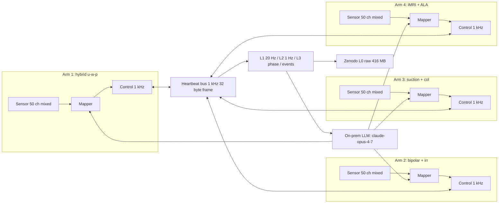

# System Architecture (4-Arm 1-Minute Variant)

## Architecture Narrative

The 1-minute glioblastoma resection simulation is built around a deterministic real-time loop that fuses high-rate per-arm sensor streams with an on-premises language model planner. Four cooperating 7-DOF arms of the hypothetical 2030 Medtronic NeuroSpeed 1.0 share a single broadcast bus that carries 32-byte heartbeat frames at 1 kHz. Each arm independently samples force at 10 kHz and joint kinematics, navigation deviation, tool flags, and safety enums at 1 kHz. The fused sensor stream feeds the per-arm xyz mapper, which emits Cartesian end-effector commands inside a 1 ms latency budget per command.

The on-premises LLM acts as the strategy layer rather than the inner-loop controller. It consumes per-second L2 aggregates, the latest L3 per-phase summary, and the running event log. It emits high-level intent overrides (slow down, switch zone, abort) that the per-arm xyz mapper then realizes. The deterministic real-time loop is responsible for safety: per-arm 5.0 N tip force clamp, cumulative 12 N four-arm clamp, 5 ms E-stop budget, and the 100 microsecond emergency arm-park trigger.

Four physical layers cooperate end-to-end:

1. Per-arm sensor ingest at mixed 1 kHz plus 10 kHz force, serialized as JSONL or Protocol Buffers.
2. Per-arm xyz mapper that consumes one MIXED record per 1 ms and emits zero or one xyz command per 1 ms, gated by safety zone, per-arm force, and the cumulative 4-arm force read from the heartbeat broadcast.
3. C++20 real-time control loop that issues commands to the simulated actuator buses at 1 kHz, with the 1 kHz heartbeat sender and receiver running in a sibling thread.
4. Aggregation pipeline that downsamples to L1 (20 Hz, 50 ms windows), L2 (1 Hz), L3 (per-phase, 4 records), plus an event log; the L0 raw is archived to Zenodo.

## System Diagram



## 4-Phase 60-Second Procedure Timeline

| Phase | Start (s) | End (s) | Duration (s) | Description |
|-------|-----------|---------|--------------|-------------|
| Pre-op (precomputed) | T-1800 | T+0 | 30 minutes | Anesthesia, registration, dural opening, multi-arm setup. Frozen at simulation start. |
| Phase 1 dural opening final and exposure | 0.000 | 5.000 | 5 s | Final dural opening, ultrasound rapid mapping, 5-ALA UV on. |
| Phase 2 bulk tumor resection | 5.000 | 45.000 | 40 s | All 4 arms active. Arm 1 cuts at 800 mm cubed per second peak. |
| Phase 3 margin assessment and fine resection | 45.000 | 55.000 | 10 s | Arm 1 reduces removal rate to 200 mm cubed per second; arm 4 imaging at 100 fps. |
| Phase 4 hemostasis verification and arm withdrawal | 55.000 | 60.000 | 5 s | Arms 1 and 3 retract; arm 2 final hemostasis; arm 4 final margin scan. |

## Per-Arm Sensor Channel Summary

| Channel group | Per-arm channels | Per-arm sample rate | Total (4 arms) |
|---------------|------------------|---------------------|----------------|
| Joint position, velocity, torque | 21 | 1 kHz | 84 |
| End-effector pose | 7 | 1 kHz | 28 |
| End-effector force, torque | 6 | 10 kHz | 24 |
| Navigation deviation | 3 | 1 kHz | 12 |
| Tool flags and adjuncts | 7 | 1 kHz | 28 |
| Safety enums and metadata | 6 | 1 kHz | 24 |
| Per-arm total | 50 | mixed | 200 |

## Per-Arm Tool Assignment

| Arm | Tool | Primary task | Force sample rate | Command sample rate |
|-----|------|--------------|--------------------|---------------------|
| 1 | Hybrid ultrasonic plus waterjet plus pulsed plasma | Bulk tumor resection (Phase 2) and fine margin resection (Phase 3) | 10 kHz | 1 kHz |
| 2 | Bipolar coagulation plus irrigation | Real-time hemostasis behind arm 1 (Phases 2, 3, 4) | 10 kHz | 1 kHz |
| 3 | Suction plus tissue collection | Continuous removal of debris and tissue collection | 10 kHz | 100 Hz |
| 4 | 0.5 T MRI plus 5-ALA fluorescence camera plus ultrasound | Continuous margin imaging, 30 fps to 100 fps | 10 kHz | 1 kHz |

## 4-Arm Coordination Diagram (verbatim)

```
+==========================================================================+
|     4-ARM COORDINATION HEARTBEAT (1 kHz, 32-byte frame, 1 ms deadline)   |
+==========================================================================+
|                                                                          |
|        +-------+  1 kHz broadcast  +-------+                             |
|        | ARM 1 |<----------------->| ARM 2 |                             |
|        | hyb.  |                   | bipol |                             |
|        | u-w-p |                   | + irr |                             |
|        +---+---+                   +---+---+                             |
|            |                           |                                 |
|            | safety_zone, ee_pos,      |                                 |
|            | force_mag, robot_state,   |                                 |
|            | heartbeat_seq, crc32      |                                 |
|            v                           v                                 |
|        +-------+                   +-------+                             |
|        | ARM 3 |<----------------->| ARM 4 |                             |
|        | suct. |  1 kHz broadcast  | iMRI  |                             |
|        | + col |                   | + ALA |                             |
|        +-------+                   +-------+                             |
|                                                                          |
|    Cumulative ee_force_magnitude across 4 arms <= 12 N                   |
|    Per-arm tip force <= 5.0 N (5x tighter than ROSA's 15 N)              |
|    E-stop latency budget 5 ms (10x faster than ROSA's 50 ms)             |
|    Heartbeat miss watchdog 3 ms triggers emergency-park sequence         |
|    Inter-arm minimum distance 8 mm (1 mm above 7 mm tool clearance)      |
+==========================================================================+
```

## Pyramid Levels (per iteration)

| Level | Sample rate | Per-arm rows | 4-arm size | All 16 iterations | In 10 MB committed cap? |
|-------|-------------|--------------|------------|---------------------|-------------------------|
| L0 raw mixed | 1 to 10 kHz | 600,000 | 26 MB | 416 MB | Zenodo only, never Git |
| L1 20 Hz | 20 Hz | 1,200 | 480 KB | 7.7 MB | yes |
| L2 1 Hz | 1 Hz | 60 | 24 KB | 384 KB | yes |
| L3 per-phase | per phase | 4 | under 4 KB | under 64 KB | yes |
| Event log | event-driven | 50 to 200 | 8 KB | 128 KB | yes |

## Pointer to ASCII Facility View

The full ASCII operating-suite snapshot lives in `architecture_overview_4arm.txt` next to this file. The snapshot covers the four arm mounts, the iMRI bore, the surgeon station, and the data sink relay; the heartbeat replica in that file mirrors the diagram above.
