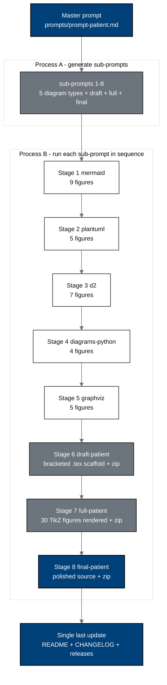

# patient-robot-advocacy - Patient Robot Advocacy Paper, Phase 1 PDAC (v1.0.0)

[](https://creativecommons.org/licenses/by/4.0/)
[](final-patient)
[](inputs)
[](.)
[](#the-thirty-figures)
[](#the-thirty-figures)
[](.)
[](sub-prompts)
[](https://doi.org/10.5281/zenodo.21720120)
[](https://doi.org/10.5281/zenodo.20619762)
[](https://orcid.org/0009-0007-5457-8667)
[](../releases.md)

This directory holds the autonomous, single-prompt build of a new paper:

> **Patient Robot Advocacy: A Phase 1, First-in-Human, PDAC Clinical Trial Protocol of a
> LLM-Directed Robotic Whipple with Daraxonrasib (RMC-6236)**
> Kevin Kawchak, CEO ChemicalQDevice. Draft 1.0, San Diego, July 31, 2026.
> Paper v1.0: [`10.5281/zenodo.21720120`](https://doi.org/10.5281/zenodo.21720120) -
> Repository v1.0.0:
> [github.com/kevinkawchak/robotic-surgeries/tree/main/patient-robot-advocacy](https://github.com/kevinkawchak/robotic-surgeries/tree/main/patient-robot-advocacy)

## What this paper is

The parent document at [`inputs/phase-1-trial-protocol.zip`](inputs) is written for the
FDA, the IRB, the sponsor, and the site. It is correct, complete, and almost unreadable to
the person whose abdomen is being opened. This paper is written for that person.

It takes the same Phase 1 trial - an on-premises LLM-directed eight-arm robotic Whipple
with perioperative daraxonrasib in KRAS-mutated PDAC - and re-presents it as an argument to
the patient: here is every documented concern people actually have about surgical robots,
here is the specific clause, limit, gate, or number in this protocol that answers it, and
here is where that number came from. It is a proponent's document. It argues that a
patient who understands this protocol has less to fear from it than from the alternative,
and it does so with the protocol's own quantitative record rather than with reassurance.

The premise is inherited from
[`inputs/patient-priority-physical-ai.zip`](inputs): the cancer patient, not the doctor,
not the nurse, not the trial sponsor, not the IRB, and not the regulator, is the priority
participant in a United States oncology clinical trial.

## The twenty-one documented concerns

Six concern families from Gemini 3.1 Pro and sixteen numbered concerns from ChatGPT 5.6
Thinking Extended, both dated July 28, 2026, de-duplicated to twenty-one. Each one is
enumerated in § 3 of the paper and wired to its answering clause in Figure 6.

| Family | Concerns | Paper answer |
|:--|:--|:--|
| Control and the human element | who is driving, override and rescue, automation bias, loss of personal care | § 7.3, § 7.4; the surgeon approves every motion and the e-stop is bounded at 3 ms cross-arm and 500 ms system-wide |
| Safety and technical failure | malfunction, unintended motion, black-box unpredictability, conversion | § 7.4, § 7.5; per-arm tip force at most 3 N, cumulative at most 18 N, vascular no-fly gating, a fault tree with a named barrier per hazard |
| Evidence and effectiveness | cancer control, experimental unknowns, hype | § 4.2, § 10; R0 rate, ISGPS grade B/C fistula rate, 90-day mortality, each against a nationwide comparator |
| Data, privacy, and security | recording, secondary use, cybersecurity, network dependence | § 9.3, § 9.4; on-premises inference, hash-chained audit trail, no external network path during a procedure |
| Fairness and applicability | bias, subgroup performance, software drift, versioning | § 6.3, § 8.3; frozen software version per participant, re-consent on any change |
| Accountability and burden | who is to blame, team experience, cost, post-trial care | § 11, § 12; a named responsible decision-maker per phase, and cost coverage stated line by line |

## Build pipeline



## Milestone schedule (one pull request, updated as each lands)

| Milestone | Stage | Output directory | Commits | Status |
|:--|:--|:--|:--|:--|
| M1 | Bootstrap (Process A) | [`prompts/`](prompts), [`sub-prompts/`](sub-prompts), directory READMEs | 16 | complete |
| M2 | Stage 1 mermaid | [`mermaid/`](mermaid) | 11 | complete |
| M3 | Stage 2 plantuml | [`plantuml/`](plantuml) | 7 | complete |
| M4 | Stage 3 d2 | [`d2/`](d2) | 9 | complete |
| M5 | Stage 4 diagrams-python | [`diagrams-python/`](diagrams-python) | 6 | complete |
| M6 | Stage 5 graphviz | [`graphviz/`](graphviz) | 7 | complete |
| M7 | Stage 6 draft-patient | [`draft-patient/`](draft-patient) | 19 | complete |
| M8 | Stage 7 full-patient | [`full-patient/`](full-patient) | 26 | complete |
| M9 | Stage 8 final-patient | [`final-patient/`](final-patient) | 20 | complete |
| M10 | Release (v1.0.0) | root `README.md`, `CHANGELOG.md`, `releases.md`, `prompts/output-patient.md` | 5 | complete |

Counts are the commits whose subject carries that stage's prefix, read from the git log
rather than planned in advance. Stage 7 ran six commits over its plan because five figures
had to be rebuilt after the second verification pass.

## Directory map

```
patient-robot-advocacy/
  README.md               (this build hub)
  prompts/                prompt-patient.md (master, verbatim) + output-patient.md
  sub-prompts/            prompt-1-mermaid .. prompt-8-final-patient (Process A)
  mermaid/       (Stage 1) 9 mermaid-type sources: figures 1, 3, 7, 10, 14, 19, 23, 24, 27
  plantuml/      (Stage 2) 5 PlantUML-type sources: figures 8, 12, 15, 18, 22
  d2/            (Stage 3) 7 D2-type sources: figures 4, 5, 11, 16, 20, 26, 29
  diagrams-python/ (Stage 4) 4 Diagrams (Python)-type sources: figures 9, 17, 25, 30
  graphviz/      (Stage 5) 5 Graphviz-type sources: figures 2, 6, 13, 21, 28
  draft-patient/ (Stage 6) main.tex, patientstyle.sty, references.bib, sections/, zip
  full-patient/  (Stage 7) the same set, fully rendered
  final-patient/ (Stage 8) the same set, polished (no publication subdirectory)
  inputs/                 the five author source documents
  references/             the author's up-to-date references.bib
  research/               the two dated 2026 patient-concern markdowns
  template/               the trial-protocol-template workflow this build adapts
```

## The finished paper, in numbers

The build ends at [`final-patient/`](final-patient). Everything below is measured from the
committed source, not planned.

| | Value |
|:--|:--|
| Pages | 88 |
| Sections | 13 |
| Figures | 30, across five diagram types, in ascending order of appearance |
| Tables | 43, every one at body text width and every one breakable |
| Visible text characters | 168,275, against the parent protocol's 155,222 |
| Bibliography | 51 entries, every DOI printed and hyperlinked |
| pdfLaTeX | 0 errors, 0 overfull boxes, 0 undefined citations, 0 undefined references |
| Raster images | none, every figure is TikZ vector art |
| Pages with a trailing gap over 3 cm | 15, of which 11 are a section's last page |

The three paper stages are kept rather than overwritten, so the build is auditable:
[`draft-patient/`](draft-patient) is the scaffold with 78 bracketed instructions,
[`full-patient/`](full-patient) executes them and draws all thirty figures, and
[`final-patient/`](final-patient) is the proof-reading pass over that. Each carries its own
`prompt-*.md`, `output-*.md`, and Overleaf archive.

## The paper's thirteen sections

| § | Section | File | Figures |
|:--|:--|:--|:--|
| 1 | Statement of Patient Commitment | `sec-00-front.tex` | 1, 2 |
| 2 | Plain-Language Protocol Summary | `sec-01-summary.tex` | 3, 4 |
| 3 | The Documented Patient Concerns | `sec-02-concerns.tex` | 5, 6, 7, 8, 9 |
| 4 | Objectives and Patient-Facing Endpoints | `sec-03-objectives.tex` | 10, 11 |
| 5 | Study Design Explained | `sec-04-design.tex` | 12, 13 |
| 6 | Who Can Join, and Who Decides | `sec-05-population.tex` | 14, 15, 16 |
| 7 | What Happens in the Operating Room | `sec-06-intervention.tex` | 17, 18, 19, 20, 21 |
| 8 | Stopping, Withdrawing, Changing Your Mind | `sec-07-discontinuation.tex` | 22, 23 |
| 9 | Your Visits, Your Data, Your Robot Instructions | `sec-08-assessments.tex` | 24, 25, 26 |
| 10 | The Numbers Behind the Reassurance | `sec-09-evidence.tex` | 27, 28 |
| 11 | Accountability, Oversight, and Who Answers | `sec-10-accountability.tex` | 29 |
| 12 | Patient Rights, Costs, and H. R. 9510 v5 | `sec-11-rights.tex` | 30 |
| 13 | References and Back Matter | `sec-12-references-backmatter.tex` | none |

## The thirty figures

Numbered 1 to 30 across the whole paper. The count per type follows the purpose of the
diagram and its location, not an equal quota.

| Type | Count | Directory | Figure numbers |
|:--|:--|:--|:--|
| Mermaid-type | 9 | [`mermaid/`](mermaid) | 1, 3, 7, 10, 14, 19, 23, 24, 27 |
| D2-type | 7 | [`d2/`](d2) | 4, 5, 11, 16, 20, 26, 29 |
| PlantUML-type | 5 | [`plantuml/`](plantuml) | 8, 12, 15, 18, 22 |
| Graphviz-type | 5 | [`graphviz/`](graphviz) | 2, 6, 13, 21, 28 |
| Diagrams (Python)-type | 4 | [`diagrams-python/`](diagrams-python) | 9, 17, 25, 30 |

## Colour scheme

The parent protocol's palette, extended by exactly three grayscale fills and exactly two
lighter shades of Corporate Blue, per the master prompt. No figure uses a colour outside
this set.

| Role | Name | Hex |
|:--|:--|:--|
| Patient-facing guarantees, end goals, the investigational system | Corporate Blue | `#00417A` |
| Process, oversight, and non-investigational context | Professional Gray | `#6C757D` |
| Inputs, context, and every figure background | Classic White | `#FFFFFF` |
| Grayscale light | `pagrayl` | `#E9ECEF` |
| Grayscale medium | `pagraym` | `#CED4DA` |
| Grayscale medium-dark | `pagrayd` | `#9AA1A8` |
| Lighter blue 1 | `pablue1` | `#3C7DB2` |
| Lighter blue 2 | `pablue2` | `#DCE8F1` |
| Emphasis fill, used sparingly | `padark` | `#222222` |
| Strokes and body text | Black | `#000000` |

## Sources used, and where

| Source | Supplies | Used in |
|:--|:--|:--|
| [`inputs/phase-1-trial-protocol.zip`](inputs) | the clinical protocol, the LaTeX style base, the BibTeX format | every section, every figure |
| [`inputs/patient-priority-physical-ai.zip`](inputs) | the patient-as-priority premise and the bill framing | § 1, § 6, § 11, § 12; figures 2, 14, 15, 16, 29 |
| [`inputs/cancer-patient-journey.zip`](inputs) | the autonomous single-patient journey, NSCLC, distinguished from PDAC | § 2, § 7, § 9; figures 3, 9, 17, 25 |
| [`inputs/patient-robot-instructions.tex`](inputs) | the ten robot-type instruction sheets, re-scoped to PDAC | § 9; figure 26 |
| [`inputs/phase-1-six-platform-diagrams.zip`](inputs) | the five TikZ diagram vocabularies, as context only | `patientstyle.sty` |
| [`research/research-a.md`](research) | the Gemini concern families | § 3; figures 5, 6, 7 |
| [`research/research-b.md`](research) | the sixteen ChatGPT concerns and thirteen new BibTeX entries | § 3 and the bibliography |
| [`references/references.bib`](references) | the author works and the H. R. 9510 v5 legislation citation | every section |
| [`template/trial-protocol-template.zip`](template) | the eight-stage build workflow and commit discipline | [`sub-prompts/`](sub-prompts) |

## License

Released under CC BY 4.0; reproduced U.S. Government regulatory text is used under
17 U.S.C. § 105. Author: Kevin Kawchak, CEO ChemicalQDevice.

*Independent research paper and practical adoption guide. It is not medical or regulatory
advice and is not endorsed by the FDA, NIH, HHS, an IRB, ICH, or any sponsor. This work is
independent and is not endorsed or sponsored by any trial sponsor, CRO, site, IRB,
regulator, or medical society; it was adapted using Claude Code Opus 5. All figures derive
from the author's repository sources and are illustrative unless tied to a cited
reference.*
