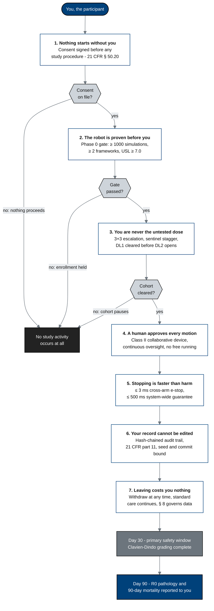

## Figure 1. The seven commitments made to you, from first conversation to day 90

**Type:** mermaid-type - `flowchart TD`
**Paper section:** § 1, Statement of Patient Commitment
**Patient concern answered:** Gemini family 1 (loss of the human element and surgeon
control) and ChatGPT concern 14 (loss of personal care and surgeon-patient trust). A
protocol opens with a Statement of Compliance addressed to regulators. This figure opens
the patient paper with the seven things the same protocol commits to the participant, each
one anchored to the protocol clause that makes it enforceable rather than aspirational.

**Why a mermaid-type flowchart.** The seven commitments are not a list; they are a sequence
in time, and each one becomes checkable at a specific moment. A flowchart top-down is the
only idiom that shows both the order and the gate that closes behind each promise.

## Palette used

| Token | Hex | Applied to |
|:--|:--|:--|
| Corporate Blue | `#00417A` | the participant node, the day-90 outcome node, commitment strokes |
| Professional Gray | `#6C757D` | the day-30 safety-window node and every edge |
| Classic White | `#FFFFFF` | the seven commitment fills |
| `pagraym` medium | `#CED4DA` | the three gate diamonds |
| `padark` (sparing) | `#222222` | the single halt node, used once |

Three-gray budget: one used (`#CED4DA`). Lighter-blue budget: none used. Black fill: one
node.

## TikZ rendering notes for `full-patient`

Draw with the `mm*` vocabulary of `patientstyle.sty`.

- `P` as `mmgoal` at `(0,0)`, `text width=34mm`.
- `C1` to `C7` as `mmin` in a single column at `x=0`, `y = -2.0, -4.4, -6.8, -9.2, -11.6,
  -14.0, -16.4`, `text width=52mm`, so 24 mm of vertical pitch leaves at least 9 mm of
  clear space between ranks.
- `G1`, `G2`, `G3` as `mmdec` at `x=5.6`, aligned with `C1`, `C2`, `C3`.
- `STOP` as `mmdark` at `(10.4,-4.4)`, reached by three `mmedged` edges that enter from the
  east of each diamond; route the second and third with
  `to[out=0,in=180,looseness=0.8]` so they do not overlap the first.
- `D30` as `mmstep` and `D90` as `mmgoal` at `y = -18.8` and `-21.0`.
- Bold the commitment number with `\textbf{}` and set the clause reference in
  `\scriptsize`.
