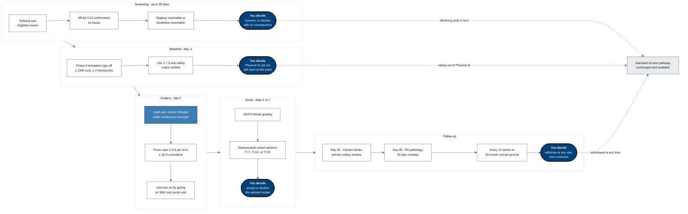

## Figure 3. Your journey through the trial, annotated with every point where you decide

**Type:** mermaid-type - `flowchart LR` (full page, landscape reading)
**Paper section:** § 2, Plain-Language Protocol Summary
**Patient concern answered:** ChatGPT concern 8 (randomization and treatment choice) and
concern 7 (unknown and experimental risks). The parent protocol's schema shows the trial
flowing through the participant. This figure inverts it: the same schema, redrawn so that
every node the participant controls is filled Corporate Blue and every node the sponsor
controls is gray, which makes the balance of control visible at a glance rather than
arguable.

**Distinguished from the NSCLC journey.** The structure is adapted from the author's
autonomous single-patient journey simulation, which was **non-small cell lung cancer**.
This journey is **PDAC**: the operation is a pancreaticoduodenectomy rather than a
lobectomy, the drug is daraxonrasib rather than a checkpoint inhibitor, the dominant
early complication is a pancreatic fistula rather than a prolonged air leak, and the
survival baseline is far lower.

## Palette used

| Token | Hex | Applied to |
|:--|:--|:--|
| Corporate Blue | `#00417A` | the four decision nodes that belong to the participant |
| `pablue1` lighter blue | `#3C7DB2` | the operation itself, the one investigational act |
| Professional Gray | `#6C757D` | sponsor-node strokes, lane borders, and every edge |
| Classic White | `#FFFFFF` | sponsor-controlled steps |
| `pagrayl` light | `#E9ECEF` | the standard-of-care exit node |

Three-gray budget: one used. Lighter-blue budget: one used. Black fill: none.

## TikZ rendering notes for `full-patient`

Full-page figure. Draw with `mm*` plus `mmlane` for the five phase lanes.

- Five lanes left to right at `x = 0, 4.6, 9.2, 13.4, 18.0`, each an `mmlane` fitted over
  its members with an `mmlanetitle` anchored `south west` on the lane's `north west`.
- Inside a lane, stack members top to bottom with 2.1 cm pitch; `text width=30mm` for
  sponsor nodes and `34mm` for the participant nodes so the bold "You decide" line does
  not wrap awkwardly.
- Participant nodes are `mmgoal`; the operation node uses a local
  `fill=pablue1,draw=protoblue`; sponsor nodes are `mmin` with `draw=protogray`.
- Lane-to-lane edges leave the lane's east and enter the next lane's west with
  `mmedgeb`, at the vertical midpoint of the lane, so no edge crosses a member box.
- The three dotted exits to `OUT` are `mmedged` routed **below** all lanes at `y = -11.2`
  using `-| ` right-angle routing, never diagonally through a lane.
- `OUT` sits centred beneath the lanes at `(11.0,-12.4)` as an `mmin` with `fill=pagrayl`.
