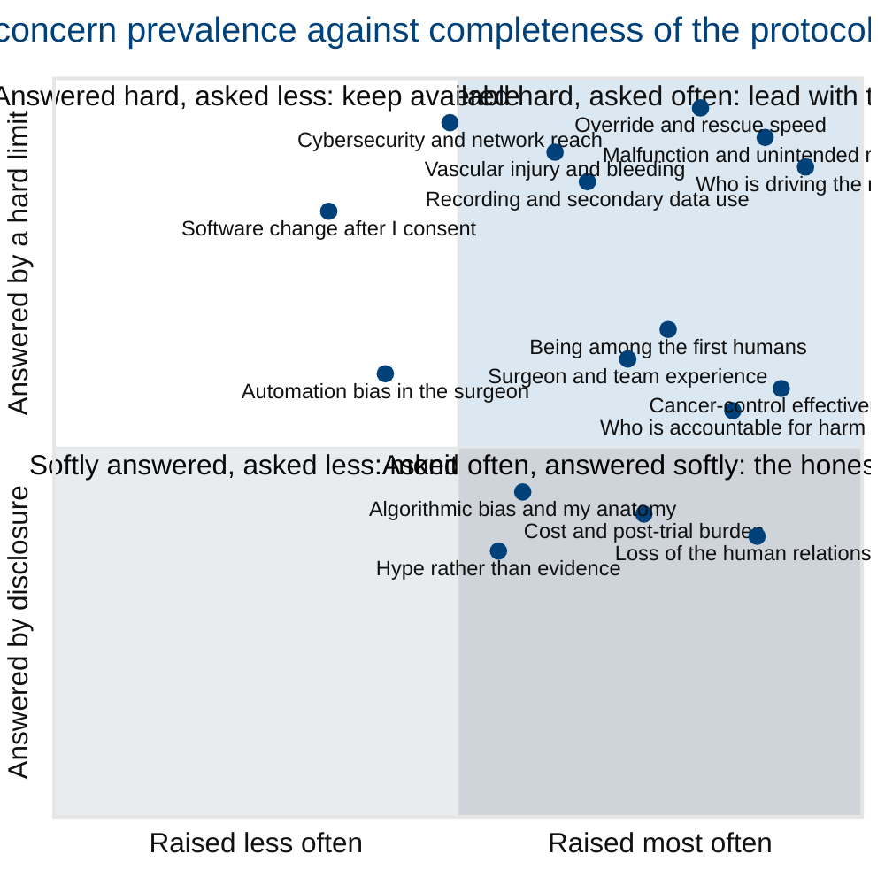

## Figure 7. How common each concern is, against how completely this protocol answers it

**Type:** mermaid-type - `quadrantChart`
**Paper section:** § 3, The Documented Patient Concerns
**Patient concern answered:** all twenty-one at once, by refusing to pretend they are
equally well answered. The honest position of a proponent's paper is that some concerns
have a hard, auditable answer in this protocol and others have only a partial one. Placing
each concern on two axes says which is which before the patient has to ask.

**Why a mermaid-type quadrant.** A ranked list implies a single ordering. Two independent
axes - how often the concern is raised in the literature, and how completely a clause in
this protocol closes it - are the only honest representation, and the quadrant is the
Mermaid primitive built for exactly that.

**Axis definitions.** The x-axis is prevalence, scored from the frequency with which the
concern appears across the surveyed sources: the 50-patient semi-autonomous surgery study,
the 330-patient oncology AI attitude survey, the systematic review of public perspectives,
and the public-misconception survey. The y-axis is answer completeness, scored 0 to 1 by
whether the protocol supplies a numeric limit (1.0), a procedural guarantee (0.7), a
governance commitment (0.5), or a disclosure only (0.3).

## Reading the four quadrants

| Quadrant | Meaning for the reader | Concerns landing there |
|:--|:--|:--|
| 1, upper right | Asked most, answered with a number | driving, override, malfunction, recording |
| 2, upper left | Answered with a number, asked less | cybersecurity, software change, vascular injury |
| 3, lower left | Answered softly, asked less | hype, automation bias, bias and anatomy |
| 4, lower right | **The honest gap.** Asked often, answered only by governance or disclosure | cancer-control effectiveness, accountability, the human relationship, cost |

The paper does not argue quadrant 4 away. § 10 and § 11 state exactly why a first-in-human
study cannot yet supply a numeric answer on cancer control, and what would have to be true
for that to change.

## Palette used

| Token | Hex | Applied to |
|:--|:--|:--|
| Corporate Blue | `#00417A` | plotted points, axis titles, quadrant headings |
| `pablue2` lighter blue | `#DCE8F1` | quadrant 1 field, the strongest answers |
| Classic White | `#FFFFFF` | quadrant 2 field |
| `pagrayl` light | `#E9ECEF` | quadrant 3 field |
| `pagraym` medium | `#CED4DA` | quadrant 4 field, the honest gap |
| Professional Gray | `#6C757D` | axis rules and gridlines |

Three-gray budget: two used. Lighter-blue budget: one used. Black fill: none.

## TikZ rendering notes for `full-patient`

- Draw a 10 cm by 8 cm plot area; fill the four quadrant rectangles in the four fills
  above before anything else, then draw the dividing cross in `protogray` at 0.4pt.
- Points are 1.6 mm `protoblue` discs. Labels are `\tiny\sffamily` anchored away from the
  nearest quadrant edge; where two points are within 8 mm, alternate the label anchor
  between `west` and `east` and add a 0.4pt leader line so no label overlaps another.
- Axis titles in `\scriptsize\sffamily`, quadrant headings in
  `\tiny\sffamily\bfseries` anchored to the inner corner of each quadrant with 3 mm inset.
- No arrow in this figure is curved, so no looseness declaration is required.
