## Figure 10. Every endpoint, and the sentence it will let someone say about you

**Type:** mermaid-type - `flowchart TD` with three ranks
**Paper section:** § 4, Objectives and Patient-Facing Endpoints
**Patient concern answered:** ChatGPT concern 6 (cancer-control effectiveness) and concern
15 (marketing, hype, and unrealistic expectations). An endpoint list is a promise about
what will be measured. This figure carries each endpoint one step further than the
protocol does, to the plain sentence a clinician will be able to say to the participant or
their family once that endpoint reads out.

**Why a mermaid-type flowchart with fixed ranks.** The relationship is strictly
three-layered - objective, endpoint, plain meaning - and a top-down flowchart with
`rank`-equivalent placement is the idiom that makes the layering visible while keeping
every path traceable from left to right within its layer.

```mermaid
%%{init: {'theme':'base','themeVariables':{'fontSize':'11px','primaryColor':'#FFFFFF','primaryTextColor':'#111111','lineColor':'#6C757D'}}}%%
flowchart TD
    O1["<b>Primary objective</b><br/>Characterise safety and<br/>feasibility of the combination"]:::obj
    O2["<b>Secondary objective</b><br/>Estimate oncologic and<br/>survival performance"]:::obj
    O3["<b>Exploratory objective</b><br/>Quantify the advisory<br/>layer's contribution"]:::objx

    E1["DLT rate across<br/>DL1 to DL3"]:::ep
    E2["Device- and procedure-related<br/>SAE rate to day 30"]:::ep
    E3["Clavien-Dindo grade<br/>III or higher rate"]:::ep
    E4["R0 resection rate at<br/>day-90 pathology"]:::ep
    E5["ISGPS grade B/C<br/>fistula rate"]:::ep
    E6["90-day mortality"]:::ep
    E7["PFS and OS<br/>to 24 months"]:::ep
    E8["Advisory concordance and<br/>override rate"]:::epx

    M1["\"The dose you were given<br/>was tolerated at your level.\""]:::mean
    M2["\"Nothing the device did<br/>caused you serious harm.\""]:::mean
    M3["\"Your recovery needed no<br/>unplanned major intervention.\""]:::mean
    M4["\"The margins came back clear.\""]:::meank
    M5["\"Your pancreas join healed<br/>without a draining leak.\""]:::mean
    M6["\"You were alive at three months.\""]:::meank
    M7["\"The cancer had not returned<br/>by this visit.\""]:::meank
    M8["\"Your surgeon disagreed with<br/>the model here, and was free to.\""]:::mean

    O1 --> E1 --> M1
    O1 --> E2 --> M2
    O1 --> E3 --> M3
    O2 --> E4 --> M4
    O2 --> E5 --> M5
    O2 --> E6 --> M6
    O2 --> E7 --> M7
    O3 --> E8 --> M8

    classDef obj fill:#00417A,stroke:#000000,stroke-width:1.3px,color:#FFFFFF
    classDef objx fill:#6C757D,stroke:#000000,stroke-width:1.1px,color:#FFFFFF
    classDef ep fill:#FFFFFF,stroke:#00417A,stroke-width:1px,color:#111111
    classDef epx fill:#E9ECEF,stroke:#6C757D,stroke-width:1px,color:#111111
    classDef mean fill:#DCE8F1,stroke:#3C7DB2,stroke-width:1px,color:#111111
    classDef meank fill:#3C7DB2,stroke:#00417A,stroke-width:1.2px,color:#FFFFFF
```

## What the third rank is for

The protocol stops at rank two. A patient who reads only rank two learns that the study
measures an "ISGPS grade B/C postoperative pancreatic fistula rate" and is no better
informed than before. Rank three is the paper's contribution: the endpoint restated as the
sentence it authorises. The three nodes filled `#3C7DB2` are the three sentences that
patients in the surveyed literature said mattered most - clear margins, being alive, and
the cancer not having returned.

## Palette used

| Token | Hex | Applied to |
|:--|:--|:--|
| Corporate Blue | `#00417A` | the two confirmatory objectives and endpoint strokes |
| Professional Gray | `#6C757D` | the exploratory objective and every edge |
| Classic White | `#FFFFFF` | the seven confirmatory endpoints |
| `pagrayl` light | `#E9ECEF` | the exploratory endpoint |
| `pablue1` lighter blue | `#3C7DB2` | the three sentences patients ranked highest |
| `pablue2` lighter blue | `#DCE8F1` | the remaining plain-meaning nodes |

Three-gray budget: one used. Lighter-blue budget: two used. Black fill: none.

## TikZ rendering notes for `full-patient`

- Three ranks at `y = 0`, `y = -3.0`, `y = -6.4`. Rank 1 has three nodes at
  `x = 0, 6.0, 12.0`; rank 2 has eight nodes at `x = -1.2` stepping by `2.1`; rank 3 sits
  directly beneath its rank-2 parent.
- Rank-2 `text width=26mm`, rank-3 `text width=30mm`, so the widest rank-3 node still
  leaves 6 mm of clear space from its neighbour.
- Objective-to-endpoint edges leave the objective's south and enter the endpoint's north.
  Where an objective feeds four endpoints, fan out with
  `to[out=-90,in=90,looseness=0.7]` rather than straight diagonals, so no edge passes
  through a sibling endpoint box.
- Quotation marks in rank three are set with `` `` `` and `''`, and the whole node is
  `\itshape`.
