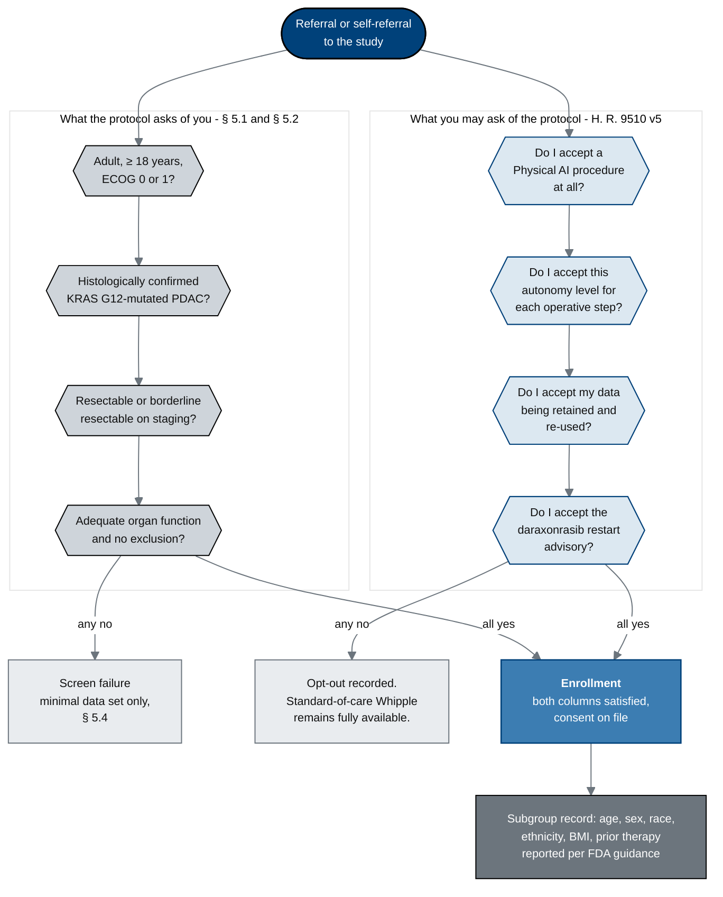

## Figure 14. Eligibility as a two-way gate: what the protocol asks, and what you may refuse

**Type:** mermaid-type - `flowchart TD` with two facing decision columns
**Paper section:** § 6, Who Can Join, and Who Decides
**Patient concern answered:** ChatGPT concern 12 (bias and applicability to the individual
patient) and concern 8 (treatment choice), plus the Gemini accountability family. Standard
eligibility flowcharts run in one direction: the protocol tests the patient and returns
eligible or screen failure. This figure draws the second direction as well, because under
the author's proposed legislation the participant is the one doing the selecting.

**Why a mermaid-type flowchart with two decision columns.** Eligibility is genuinely two
decision processes running against each other, and the only way to show that neither is
subordinate is to give each its own column of diamonds and let the two converge on a single
enrollment node.

## The asymmetry the figure removes

| | Protocol column | Participant column |
|:--|:--|:--|
| Who authors the criteria | Sponsor-Investigator, reviewed by the IRB | the participant, informed by § 3 of this paper |
| What a "no" produces | screen failure, minimal data set retained under § 5.4 | opt-out recorded, standard-of-care pathway unchanged |
| Can it be revisited | only by protocol amendment | at any visit, without giving a reason |
| Is it recorded | yes, in the screening log | yes, in the consent record, per H. R. 9510 v5 |

The right-hand column is the contribution of the author's proposed legislation. Without
it, the participant's four questions are asked informally, answered informally, and leave
no trace in the record.

## Palette used

| Token | Hex | Applied to |
|:--|:--|:--|
| Corporate Blue | `#00417A` | the entry node and the participant-gate strokes |
| `pablue1` lighter blue | `#3C7DB2` | the enrollment node where both columns meet |
| `pablue2` lighter blue | `#DCE8F1` | the four participant decision diamonds |
| Professional Gray | `#6C757D` | the subgroup-record node and every edge |
| `pagraym` medium | `#CED4DA` | the four protocol decision diamonds |
| `pagrayl` light | `#E9ECEF` | the two exit nodes |

Three-gray budget: two used. Lighter-blue budget: two used. Black fill: none.

## TikZ rendering notes for `full-patient`

- Two `mmlane` boxes side by side, left lane centred at `x = -3.4`, right lane at
  `x = 4.6`, each 2.2 cm wider than its widest diamond so the lane border never touches a
  node.
- Diamonds are `mmdec` with `text width=26mm`, stacked at `y = -2.4, -4.8, -7.2, -9.6`;
  2.4 cm of pitch keeps at least 8 mm of clear space between diamond tips.
- `START` at `(0.6,0)`; its two outgoing edges use
  `to[out=-150,in=90,looseness=0.75]` and `to[out=-30,in=90,looseness=0.75]` so neither
  clips the lane titles.
- `SF` at `(-8.4,-11.8)` and `OPT` at `(9.6,-11.8)`; `ENR` at `(0.6,-12.6)`; `SUB` at
  `(0.6,-14.8)`. The two "all yes" edges into `ENR` use
  `to[out=-90,in=150,looseness=0.8]` and `to[out=-90,in=30,looseness=0.8]`.
- Set the lane titles in `mmlanetitle`, anchored `south west` on each lane's `north west`.
