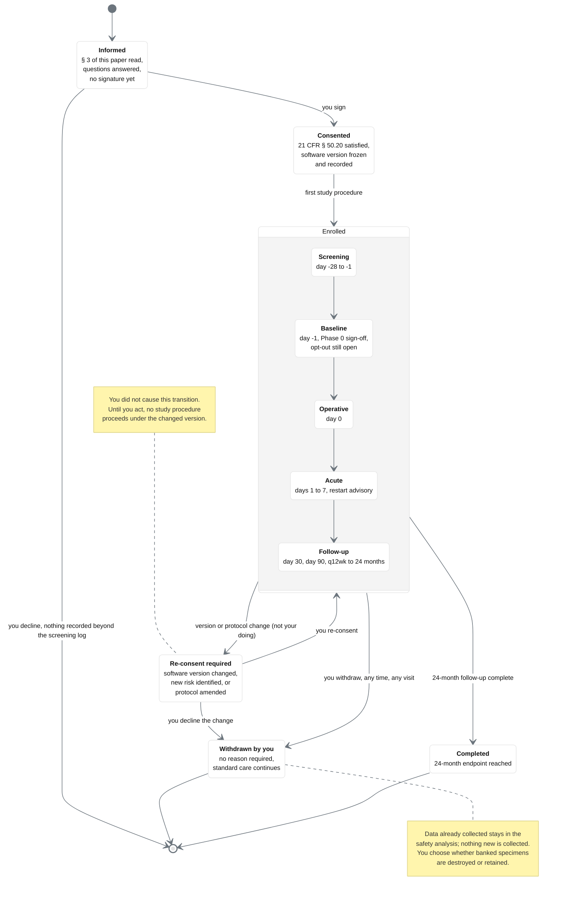

## Figure 23. Your consent is a state, not a signature: every transition you can trigger

**Type:** mermaid-type - `stateDiagram-v2` with a nested composite state
**Paper section:** § 8, Stopping, Withdrawing, Changing Your Mind
**Patient concern answered:** ChatGPT concern 13 (software changes, versioning, and
performance drift) and concern 8 (treatment choice), plus the withdrawal half of concern
16. A consent form implies a one-time act. In a Physical AI trial the thing consented to
can change while the participant is still enrolled, so consent has to be modelled as a
state machine with a re-consent transition, and the patient should be shown that machine.

**Why a mermaid-type state diagram.** Only a state machine can express that withdrawal is
reachable from every state, that re-consent is forced by an external event the participant
did not cause, and that two different terminal states exist with different data
consequences.

## The two transitions the parent protocol does not draw

| Transition | Why it matters to the participant |
|:--|:--|
| `Enrolled --> ReConsent` | An AI-enabled device can be updated. If the version that operates on the participant is not the version they consented to, the consent is stale. This protocol freezes the version at consent and forces a re-consent on any change, so the participant is never operated on by software they have not been told about. |
| `ReConsent --> Withdrawn` | Declining a change must be a real option, not a formality. Declining ends participation and returns the participant to standard care with no penalty and no loss of any care they were already receiving. |

## Palette used

| Token | Hex | Applied to |
|:--|:--|:--|
| Corporate Blue | `#00417A` | the `Consented` and `Completed` states, initial and final marks |
| `pablue2` lighter blue | `#DCE8F1` | the five nested `Enrolled` substates |
| `pagraym` medium | `#CED4DA` | the `ReConsent` state, the transition the participant did not cause |
| `pagrayl` light | `#E9ECEF` | the two note boxes and the `Informed` state |
| Professional Gray | `#6C757D` | the `Enrolled` composite border and every transition arrow |
| Classic White | `#FFFFFF` | the field and the `Withdrawn` state |

Three-gray budget: two used. Lighter-blue budget: one used. Black fill: none.

## TikZ rendering notes for `full-patient`

- `umlinit` filled disc at `(0,1.4)`; `umlfinal` ringed discs at `(-5.4,-13.0)` and
  `(5.4,-13.0)`.
- `Informed` and `Consented` as `umlstate` at `(0,0)` and `(0,-2.2)`, `text width=32mm`.
- The `Enrolled` composite is a `umlpkg` rounded rectangle fitted over five `umlstate`
  substates stacked at `y = -4.8` to `-10.4` with 1.4 cm pitch and `text width=30mm`;
  the composite's own title tab sits `north west`.
- `ReConsent` at `(6.4,-6.6)`, `Withdrawn` at `(-6.4,-9.4)`, `Completed` at `(0,-12.0)`.
- Every transition is `umlarrow` with a `\tiny\sffamily` label placed in a white-filled
  `mmlabel` node at the arrow midpoint so the label never sits on the line.
- The two long transitions out of the composite use
  `to[out=0,in=90,looseness=0.9]` and `to[out=180,in=90,looseness=0.9]`; they leave the
  composite border, not a substate, so no arrow crosses a substate box.
- Notes are `umlnote` boxes with a 0.5pt dashed leader to their anchor state.
