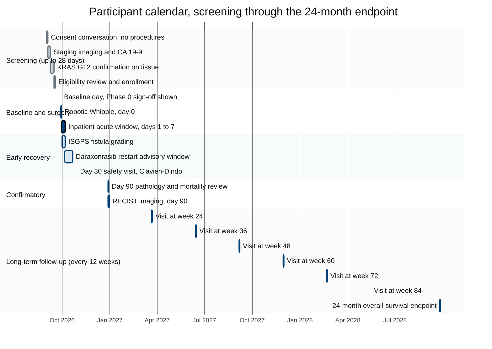

## Figure 25. Your calendar: every visit, how long it takes, and what it is for

**Type:** mermaid-type - `gantt`
**Paper section:** § 9, Your Visits, Your Data, Your Robot Instructions
**Patient concern answered:** ChatGPT concern 16 (practical, financial, and post-trial
burdens) and the scheduling half of concern 7. The Schedule of Activities in the parent
protocol is a matrix of crosses. A participant planning work, travel, and caregiving needs
a calendar with durations, not a matrix with crosses.

**Why a mermaid-type Gantt.** Duration and overlap are the two facts a matrix cannot show.
The participant's real question is "how many days of my life does this take, and when",
and a Gantt answers it directly.

## The burden, totalled

| Phase | Visits | Days in hospital | Days at a clinic | Notes for planning |
|:--|:--|:--|:--|:--|
| Screening | 4 | 0 | about 4 | imaging and tissue work; no study procedure before consent |
| Baseline and surgery | 2 | 8 to 10 | 1 | the single inpatient stay of the study |
| Early recovery | 3 | 0 | 3 | the restart advisory is a conversation, not a procedure |
| Confirmatory | 2 | 0 | 2 | day 90 carries the two results most people want |
| Long-term | 7 | 0 | 7 | one half-day every 12 weeks for 24 months |
| **Total** | **18** | **8 to 10** | **about 17** | roughly 27 days of contact over 24 months |

Dates above are illustrative and anchored to a September 2026 first visit; the intervals,
not the calendar dates, are what the protocol fixes.

## Palette used

| Token | Hex | Applied to |
|:--|:--|:--|
| Corporate Blue | `#00417A` | active bars, task borders, the axis emphasis |
| `pablue1` lighter blue | `#3C7DB2` | the four critical milestones: surgery, day 30, day 90, 24-month |
| `pablue2` lighter blue | `#DCE8F1` | ordinary task bars |
| `pagraym` medium | `#CED4DA` | completed screening bars and gridlines |
| `pagrayl` light | `#E9ECEF` | alternating section bands |
| Professional Gray | `#6C757D` | section labels and bar outlines |

Three-gray budget: two used. Lighter-blue budget: two used. Black fill: none.

## TikZ rendering notes for `full-patient`

- Horizontal time axis 15 cm wide spanning September 2026 to September 2028, with month
  ticks in `protogray` 0.4pt and quarter labels in `\tiny\sffamily`.
- Five section bands as full-width rectangles alternating `pagrayl` and white, drawn first
  so every bar sits above its band.
- Bars are 3.6 mm tall with 2.2 mm of clear space between rows; a one-day task is drawn at
  a 1.4 mm minimum width so it stays visible at this compression.
- Task labels are `\tiny\sffamily` anchored `east` in the 4.6 cm label gutter at the left,
  never inside the bar, so no label can overlap a bar.
- The four critical milestones additionally carry a 0.5pt `protoblue` vertical drop line to
  the axis, labelled beneath in `\tiny\sffamily\bfseries`.
- No curved connectors in this figure, so no looseness declaration is required.
