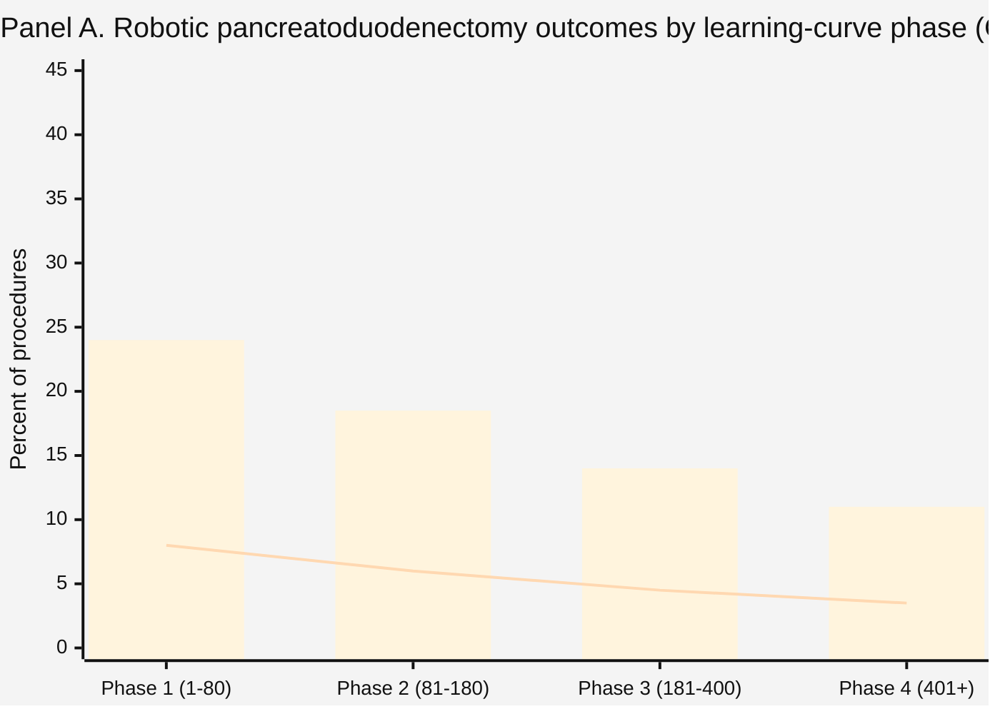
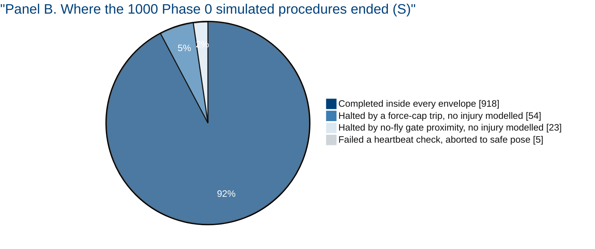

## Figure 27. The reassurance dashboard: five panels of numbers, none of them rhetorical

**Type:** mermaid-type - composite quantitative dashboard (`xychart-beta`, `pie`,
confidence-interval strip), full page
**Paper section:** § 10, The Numbers Behind the Reassurance
**Patient concern answered:** ChatGPT concern 6 (cancer-control effectiveness), concern 15
(marketing and hype), and concern 1 (safety and malfunction); Gemini families 2 and 3. A
proponent's paper earns its position by putting the numbers on one page, including the
ones that are not yet favourable, and marking clearly which are measured, which are
comparator values, and which are simulated.

**Why a mermaid-type quantitative dashboard.** Mermaid's quantitative primitives are the
only ones in the permitted set designed for magnitude rather than structure. Five panels on
one page let a reader compare across categories without turning a page, which is what a
person deciding whether to enroll actually does.

**Provenance legend used throughout.** `M` measured in a cited human series, `C`
contemporaneous nationwide comparator, `S` author simulation, `P` protocol-specified limit.
Figure 28 traces each value to its source.

*Bars: ISGPS grade B/C fistula rate. Line: 90-day mortality. Both fall monotonically with
institutional volume, which is why this protocol restricts enrollment to a site already
past phase 3 rather than treating the learning curve as an acceptable patient cost.*

*A patient reading Panel B is being told the truth about a first-in-human system: 8.2
percent of simulated procedures were stopped by a safety mechanism before completion. The
argument is not that the system never stops. It is that when it stops, it stops safely,
and it did so 82 times before any human was involved.*

```mermaid
%%{init: {'theme':'base','themeVariables':{'fontSize':'11px','primaryColor':'#DCE8F1','primaryTextColor':'#111111','lineColor':'#6C757D'}}}%%
xychart-beta
    title "Panel C. Safety-limit headroom: protocol cap against worst observed value (P, S)"
    x-axis ["Per-arm tip force (N)", "Cumulative force (N)", "Cross-arm e-stop (ms)", "System e-stop (ms/10)", "Positional error (mm)"]
    y-axis "Value against its cap" 0 --> 20
    bar [3.0, 18.0, 3.0, 50.0, 2.0]
    bar [2.1, 12.4, 1.7, 31.0, 1.3]
```

*First bar in each pair is the protocol cap; second is the worst value observed across the
Phase 0 simulation set. The system e-stop is plotted in tens of milliseconds so all five
limits share one axis. Every observed worst case sits inside its cap, and the paper states
plainly that a simulated worst case is not a human worst case.*

### Panel D. Survival context, with the honest denominator (M, C)

| Population | 5-year overall survival | Source class |
|:--|:--|:--|
| All pancreatic cancer, United States, all stages | 13 percent | M |
| Resected PDAC after adjuvant FOLFIRINOX | about 39 percent at 3 years | M |
| Resectable PDAC, R0 margin achieved | materially better than R1, magnitude series-dependent | C |
| This protocol's contribution to that number | **not yet estimable; n up to 18, safety endpoints** | P |

*The last row is the point of the panel. A Phase 1 study of eighteen participants cannot
move a survival curve and this paper does not claim it will. What it can do is establish
whether the combination is safe enough to be tested in a study that could.*

### Panel E. What each documented concern gets as an answer (P)

| Answer class | Concerns answered this way | Example |
|:--|:--|:--|
| Hard numeric limit | 7 of 21 | cross-arm emergency stop at most 3 ms |
| Procedural guarantee | 6 of 21 | surgeon approval required for every motion |
| Governance commitment | 5 of 21 | DSMB cohort-boundary review with halt authority |
| Disclosure only | 3 of 21 | long-term oncologic outcome of this specific combination |

## Palette used

| Token | Hex | Applied to |
|:--|:--|:--|
| Corporate Blue | `#00417A` | primary bars, panel titles, the protocol-cap series |
| `pablue1` lighter blue | `#3C7DB2` | the observed-value series and the second pie segment |
| `pablue2` lighter blue | `#DCE8F1` | panel backgrounds and the third pie segment |
| `pagraym` medium | `#CED4DA` | the fourth pie segment, gridlines, table rules |
| `pagrayl` light | `#E9ECEF` | alternating table row bands |
| Professional Gray | `#6C757D` | axis rules, tick labels, footnote text |

Three-gray budget: two used. Lighter-blue budget: two used. Black fill: none.

## TikZ rendering notes for `full-patient`

Full-page figure, five stacked panels inside one frame, each panel separated by a 0.4pt
`pagraym` hairline.

- **Panel A** uses `\vbarcol` for the four bars on a 6 cm axis, plus a 0.8pt `protoblue`
  polyline for the mortality series with 1.2 mm disc markers; a two-key legend via
  `\legkey`.
- **Panel B** uses `\donutseg` for four segments on a 1.9 cm outer, 1.05 cm inner ring,
  with leader lines to `\tiny\sffamily` labels placed outside the ring so no label sits on
  a segment.
- **Panel C** uses paired `\vbarcol` calls offset by 0.28 cm, cap first in `protoblue`,
  observed second in `pablue1`, with the value printed above each bar.
- **Panels D and E** are `tabularx` tables at the panel measure, not TikZ, using
  `>{\raggedright\arraybackslash}p{...}` on every fixed column.
- `\ptitle` for each panel heading, `\pnote` for each panel footnote, both anchored `west`
  at the panel's left edge so the five panels align on one vertical.
- No curved connectors, so no looseness declaration is required.
